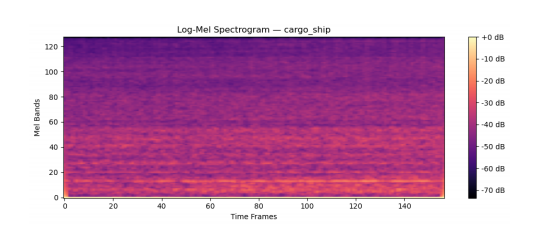
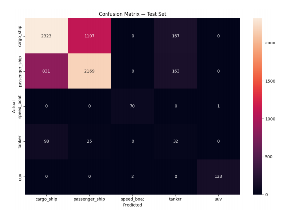
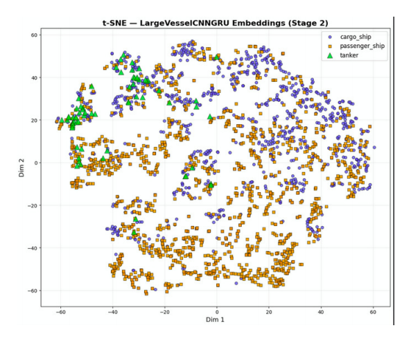

# Acoustic Ship Classification using Underwater Acoustic Signals

## Overview

This project investigates machine learning and deep learning approaches for underwater vessel classification using passive acoustic signals. The objective is to identify different vessel categories from underwater recordings by analyzing their acoustic signatures.

Passive acoustic monitoring is an important technology for maritime surveillance, naval defense, underwater security, and environmental monitoring, especially in situations where radar and optical systems are ineffective.

This project evaluates multiple classification pipelines ranging from traditional machine learning models using handcrafted features to deep learning models trained on spectrogram representations.

---

## Visualizations

### Log-Mel Spectrogram



### CNN Confusion Matrix



### t-SNE Feature Embeddings



---

## Vessel Categories

The models were trained to classify the following vessel categories:

- Cargo Ship
- Passenger Ship
- Speed Boat
- Tanker
- Unmanned Underwater Vehicle (UUV)

---

## Datasets

The project utilizes publicly available underwater acoustic datasets:

- DeepShip Dataset
- Qiandao22 Dataset
- DS3500 Dataset (Reference Benchmark)

> Note: Datasets are not included in this repository due to licensing and storage constraints.

---

## Methodology

### Audio Preprocessing

- Audio resampled to 16 kHz
- Silence trimming
- Fixed-length segmentation
- File-level stratified train/validation/test split

### Feature Extraction

#### Classical Machine Learning

- 40 MFCC coefficients
- Mean
- Standard Deviation
- Maximum
- Minimum

Resulting in a 160-dimensional feature vector.

#### Deep Learning

- Log-Mel Spectrograms
- Data Augmentation
- Normalization

---

## Implemented Models

### Model 1: MFCC + Logistic Regression

Traditional machine learning baseline using handcrafted acoustic features.

**Results**

| Metric | Value |
|----------|----------|
| Accuracy | 70% |
| Macro F1 | 0.68 |
| Weighted F1 | 0.73 |

---

### Model 2: CNN Spectrogram Classifier

Convolutional Neural Network trained directly on Log-Mel Spectrograms.

**Results**

| Metric | Value |
|----------|----------|
| Accuracy | 84% |
| Macro F1 | 0.75 |
| Weighted F1 | 0.83 |

---

### Model 3: Hierarchical Two-Stage Pipeline

A two-stage architecture designed to improve discrimination among acoustically similar large vessels.

Components:

- Enhanced CNN
- Squeeze-and-Excitation Blocks
- Attention Pooling
- CNN-GRU Stage 2 Classifier
- Focal Loss
- Weighted Random Sampling

**Results (Stage 2)**

| Metric | Value |
|----------|----------|
| Accuracy | 74% |
| Macro F1 | 0.55 |
| Weighted F1 | 0.75 |

---

### Model 4: ResNet18 Benchmark (DS3500)

A reference experiment conducted on the balanced DS3500 dataset.

**Results**

| Metric | Value |
|----------|----------|
| Macro F1 | 0.86 |
| Accuracy | 85% |

This experiment demonstrates that the proposed pipeline performs strongly when class imbalance is not a limiting factor.

---

## Key Findings

- CNN-based spectrogram classification achieved the highest overall accuracy (84%).
- MFCC + Logistic Regression remained surprisingly competitive despite its simplicity.
- Severe class imbalance significantly affected tanker classification performance.
- DS3500 experiments confirmed that dataset imbalance is the primary bottleneck rather than model capacity.
- Underwater acoustic signals contain sufficient discriminative information for reliable vessel classification.

---

## Technologies Used

- Python
- Scikit-Learn
- PyTorch
- Librosa
- NumPy
- Pandas
- Matplotlib
- Seaborn

---

## Repository Structure

```text
acoustic-ship-classification/

├── images/
├── notebooks/
├── docs/
│   └── project_report.pdf
│
├── requirements.txt
├── LICENSE
├── .gitignore
└── README.md
```

---

## Future Work

- Transformer-based acoustic models
- Self-supervised audio representation learning
- Additional tanker recordings
- Real-time vessel monitoring systems
- Deployment on embedded maritime surveillance platforms

---

## Author

**Sanjay Siddarth S**  
B.Tech Naval Architecture and Ocean Engineering  
Indian Institute of Technology Madras

